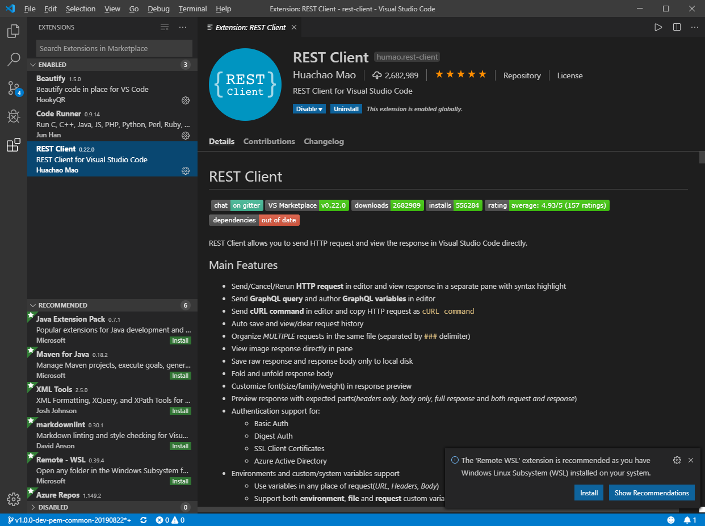
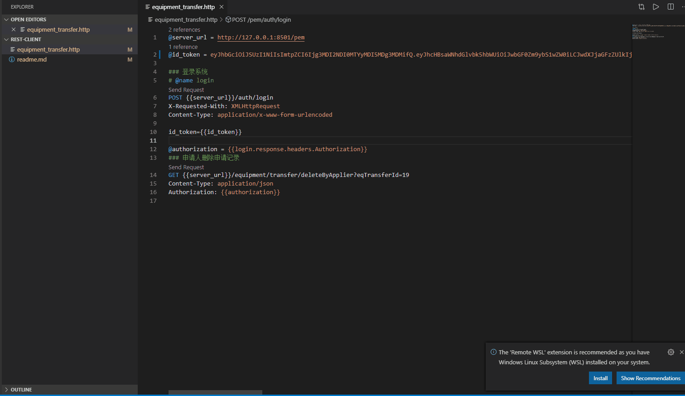

# Rest Client

Rest client file suffixed with .http.

Use rest client plugin in VSCode to open it.

Search rest client in vscode, and install REST Client(humao.rest-client) version.

---

Rendering as below:

